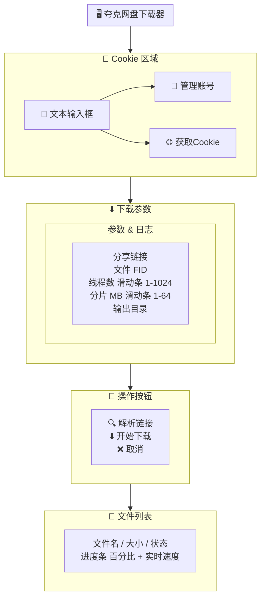

# 夸克网盘多线程下载器

一个支持多线程下载、断点续传的夸克网盘下载工具，提供友好的 GUI 界面。

## ✨ 功能特性

- 🔐 **Cookie 登录** - 通过内置浏览器获取夸克网盘 Cookie
- 🔗 **分享链接解析** - 自动解析夸克分享链接，列出文件列表
- ⬇️ **多线程下载** - 支持最多 1024 线程并发下载
- 🔄 **断点续传** - 支持暂停/恢复下载，自动续传
- 📊 **实时进度** - 显示下载百分比和实时速度
- 📁 **批量下载** - 支持批量转存并下载分享文件
- 👤 **账号管理** - 内置浏览器管理夸克网盘文件

## 📸 界面预览



## 🚀 快速开始

### 使用打包版本

1. 从 Releases 下载 `QuarkDownloader.exe`
2. 双击运行（获取cookie功能需要电脑中包含python3.8+环境）

## 📖 使用说明

### 1. 获取 Cookie（获取cookie功能需要电脑中包含python3.8+环境）

- 点击 **🌐 获取 Cookie** 按钮
- 在弹出的浏览器窗口中登录夸克账号
- 登录成功后 Cookie 会自动填入

### 2. 下载分享文件

1. 将夸克分享链接粘贴到 **分享链接** 输入框
2. 点击 **🔍 解析链接** 获取文件列表
3. 点击 **⬇ 开始下载** 开始下载

### 3. 直接下载网盘文件

1. 在 **文件 FID** 输入框中输入文件的 FID（多个用逗号分隔）
2. 点击 **⬇ 开始下载**

### 4. 参数说明

| 参数 | 默认值 | 说明 |
|------|--------|------|
| 线程数 | 32 | 并发下载线程数（1-1024） |
| 分片 MB | 1 | 每个分片的大小（1-64 MB） |
| 输出目录 | ./downloads | 文件保存位置 |

输出文件：`dist/QuarkDownloader.exe`（约 86MB）

## 📦 项目结构

```
quack/
├── quarkdl_gui.pyw      # 主程序（GUI，无控制台）
├── quarkdl_gui.py        # 同上（调试用，有控制台）
├── quarkdl.py            # 旧版独立核心库（保留备用）
├── quarkdl_login.py      # 旧版独立登录脚本（已内嵌）
├── quarkdl_manage.py     # 旧版独立管理脚本（已内嵌）
├── icon.ico              # 应用图标
├── .quarkdl_cookies.json # Cookie 持久化存储
├── downloads/            # 默认下载目录
└── README.md             # 本文件
```

## 🔧 技术栈

- **GUI 框架**: CustomTkinter（原生圆角控件）
- **浏览器**: pywebview（内置 WebView）
- **HTTP 客户端**: requests
- **图像处理**: Pillow（图标转换）
- **打包工具**: PyInstaller

## 📝 命令行模式

除了 GUI 模式，还支持命令行使用：

```bash
# 下载分享文件
python quarkdl_gui.py --cookie "your_cookie" --url "https://pan.quark.cn/s/xxxx"

# 下载指定文件
python quarkdl_gui.py --cookie "your_cookie" --fid "file_fid"

# 列出网盘文件
python quarkdl_gui.py --cookie "your_cookie" list

# 查看帮助
python quarkdl_gui.py --help
```